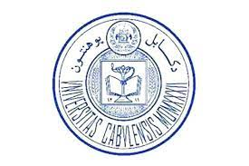

<a name="readme-top"></a>
<div align="center">
 
 
  <br/>

 
  <h3><b>CAPSTONE-PROJECT-MODULE 1</b></h3>

</div>

# 📗 Table of Contents

- [📖 About the Project](#about-project)
  - [🛠 Built With](#built-with)
    - [Tech Stack](#tech-stack)
    - [Key Features](#key-features)
  - [🚀 Live Demo](#live-demo)
  - [📹 Walkthrough ](#Walkthrough)
- [💻 Getting Started](#getting-started)
  - [Setup](#setup)
  - [Prerequisites](#prerequisites)
  - [Install](#install)
  - [Usage](#usage)
  - [Run tests](#run-tests)
  - [Deployment](#deployment)
- [👥 Authors](#authors)
- [🔭 Future Features](#future-features)
- [🤝 Contributing](#contributing)
- [⭐️ Show your support](#support)
- [🙏 Acknowledgements](#acknowledgements)
- [❓ FAQ (OPTIONAL)](#faq)
- [📝 License](#license)

# porfolio mobile version <a name="about-project"></a>

**Capstone Project** is a project that designed to provide information and resources to students, faculty members, and visitors of the university, showcasing the academic programs and research opportunities available. Built with HTML, CSS, and JavaScript

## 🛠 Built With <a name="built-with"></a>

### Tech Stack <a name="tech-stack"></a>

<details>
  <summary>Client</summary>
  <ul>
    <li><a href="https://developer.mozilla.org/en-US/docs/Web/HTML">HTML</a></li>
    <li><a href="https://developer.mozilla.org/en-US/docs/Web/CSS">CSS</a></li>
  </ul>
</details>

<details>
  <summary>Server</summary>
  <ul>
    <li>N/A</li>
  </ul>
</details>

<details>
<summary>Database</summary>
  <ul>
    <li>N/A</li>
  </ul>
</details>

### Key Features <a name="key-features"></a>

- **Display colorfull text**

<p align="right">(<a href="#readme-top">back to top</a>)</p>

## 🚀 Live Demo <a name="live-demo"></a>

- [Live Demo link](https://fatima-najafi.github.io/capstone-project-module1/)

<p align="right">(<a href="#readme-top">back to top</a>)</p>
📹 Walkthrough  <a name="Walkthrough"></a>

- [loom link](https://www.loom.com/share/00e2f5e8b4b043aeb1fe23e4f114a692?sid=ad193708-4490-46ef-90a6-53072023c42d)

<p align="right">(<a href="#readme-top">back to top</a>)</p>

## 💻 Getting Started <a name="getting-started"></a>

To get a local copy up and running, follow these steps.

### Prerequisites

In order to run this project you need:

- You need to have NodeJS installed
- A Web Browser (Google Chrome, Firefox, etc)
- A Code Editor (Notepad++, VSCode, etc)

### Setup

Clone this repository to your desired folder:

```
git clone yourlink repo https://github.com/fatima-najafi/capstone-project-module1.git

cd your folder name
```

### Install

Install this project with:

```
npm install
```

### Usage

To run the project, execute the following command:

Double-click on the index file (index.html)

### Run tests

To run tests, run the following command:

N/A

### Deployment

You can deploy this project using:

Deploy this project on any websever

<p align="right">(<a href="#readme-top">back to top</a>)</p>

## 👥 Authors <a name="authors"></a>

👤 **Fatima **

- GitHub: [@githubhandle](https://github.com/fatima-najafi)
- Twitter: [@twitterhandle](https://twitter.com)
- LinkedIn: [LinkedIn](https://www.linkedin.com/in/fatima-najafi-75424a23a/)

<p align="right">(<a href="#readme-top">back to top</a>)</p>

## 🔭 Future Features <a name="future-features"></a>

- [ ] **Add a hello animated illustration**

<p align="right">(<a href="#readme-top">back to top</a>)</p>

## 🤝 Contributing <a name="contributing"></a>

Contributions, issues, and feature requests are welcome!

Feel free to check the [issues page](../../issues/).

<p align="right">(<a href="#readme-top">back to top</a>)</p>

## ⭐️ Show your support <a name="support"></a>

If you like this project give me a star.

<p align="right">(<a href="#readme-top">back to top</a>)</p>

## 🙏 Acknowledgments <a name="acknowledgements"></a>

I would like to express my gratitude to [Microverse](https://www.microverse.org/) for their strong support.

Special thanks to [Cindy Shin](https://www.behance.net/adagio07) for here exceptional design which served as inspiration for this project.

<p align="right">(<a href="#readme-top">back to top</a>)</p>

<p align="right">(<a href="#readme-top">back to top</a>)</p>

## 📝 License <a name="license"></a>

This project is [MIT](./LICENSE) licensed.

<p align="right">(<a href="#readme-top">back to top</a>)</p>
